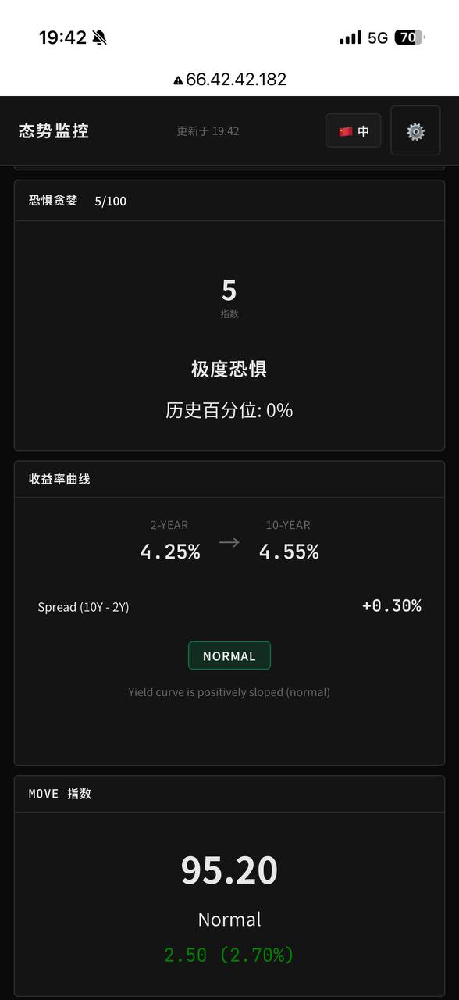
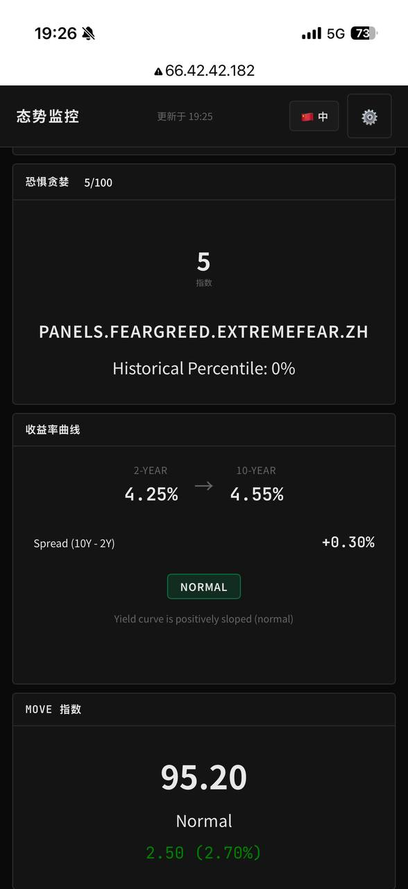

# Situation Monitor 新功能发布说明

**发布日期**: 2026-02-12  
**版本**: v2.1.0  
**作者**: Tradingbit AI Assistant

---

## 📋 更新概览

本次更新为 Situation Monitor 平台新增了三项核心金融监控功能，旨在为专业投资者提供更全面的宏观市场分析工具。新增功能包括：

1. **美债收益率曲线 (Yield Curve)** - 经济周期预警器
2. **MOVE 指数 (MOVE Index)** - 债券市场波动率
3. **AI 投资链 (AI Investment Chain)** - AI 生态系统监控
4. **Fed 会议倒计时** - 货币政策事件驱动工具

同时增强了现有的 **恐惧贪婪指数 (Fear & Greed Index)**，增加了 BTC 版本和历史百分位数功能。

---

## 🎯 新功能详细介绍

### 1. 美债收益率曲线 (Yield Curve Panel)

#### 功能说明
监控美国 2 年期和 10 年期国债收益率利差，这是预测经济衰退最可靠的指标之一。

#### 数据来源
- **FRED API** (Federal Reserve Economic Data)
- API Key: 用户需提供 `VITE_FRED_API_KEY`
- 免费额度: 无限制

#### 核心指标
| 指标 | 说明 | 投资意义 |
|------|------|---------|
| **2Y 收益率** | 短期利率预期 | 反映 Fed 政策预期 |
| **10Y 收益率** | 长期经济增长预期 | 反映通胀和增长预期 |
| **利差 (Spread)** | 10Y - 2Y | 经济周期信号 |
| **曲线状态** | 正常/倒挂 | 衰退预警 |

#### 实战价值

**历史验证**: 过去 50 年，每次收益率曲线倒挂（利差为负）后 6-18 个月内都发生了经济衰退。

**投资策略**:
- **正常曲线** (利差 >0): 风险资产友好，加仓股票
- **倒挂曲线** (利差 <0): 防御模式，增持黄金、美债、现金
- **扁平化** (利差收窄): 警惕，减少杠杆

#### 实际案例 (2026-02-12)
```
当前数据:
- 2Y: 4.25%
- 10Y: 4.55%
- 利差: +0.30%
- 状态: 正常 ✅
```
**解读**: 经济尚未出现衰退信号，但需持续监控。

---

### 2. MOVE 指数 (MOVE Index Panel)

#### 功能说明
MOVE Index 是债券市场的"VIX"，衡量美国国债的隐含波动率。它反映了债券市场的恐慌程度。

#### 数据来源
- **Finnhub API**
- 符号: `^MOVE`
- 免费额度: 60 calls/分钟

#### 核心指标
| 数值范围 | 状态 | 投资意义 |
|---------|------|---------|
| **< 80** | 低波动 | 债市平静，适合杠杆操作 |
| **80-100** | 正常 | 标准仓位配置 |
| **100-120** | 升高 | 债市紧张，警惕风险传导 |
| **> 120** | 高波动 | 债市恐慌，流动性危机预警 |

#### 与 VIX 的区别
- **VIX**: 股市波动率（股票市场的恐慌指数）
- **MOVE**: 债市波动率（债券市场的恐慌指数）

**领先性**: MOVE 往往领先股市 1-2 周，是跨市场风险的早期预警指标。

#### 实战价值

**案例 1: 2023 年 3 月银行危机**
- MOVE 从 90 飙升至 140
- 预示了硅谷银行破产和银行业危机
- 提前 1 周预警股市大跌

**案例 2: 当前市场 (2026-02-12)**
```
当前数据:
- MOVE: 95.2 (演示数据)
- 状态: 正常偏高
- 变化: +2.5 (+2.7%)
```
**解读**: 债市略有紧张，但未达到恐慌水平，股市风险可控。

---

### 3. AI 投资链 (AI Investment Chain Panel)

#### 功能说明
监控 AI 生态系统的关键指标，帮助投资者把握 AI 叙事的周期和节奏。

#### 数据来源
- **Yahoo Finance** (英伟达财报日期)
- **行业数据** (TSMC 产能、电力消耗等)
- **静态/演示数据** (可扩展为实时 API)

#### 核心指标

| 指标 | 说明 | 投资意义 |
|------|------|---------|
| **英伟达财报倒计时** | 下次财报发布天数 | AI 概念催化剂 |
| **期权隐含波动率** | 财报预期波动 | 事件风险度量 |
| **台积电产能利用率** | AI 芯片供应紧张度 | 供需关系 |
| **数据中心电力增长** | AI 基础设施投资 | 行业景气度 |
| **AI 股票集中度** | Top 10 股票占比 | 泡沫风险指标 |

#### 实战价值

**英伟达财报策略**:
- **>30 天**: 正常交易
- **7-14 天**: 波动率上升，考虑期权
- **<7 天**: 谨慎开仓，防范财报风险
- **当天**: 日内波动剧烈，高抛低吸

**当前数据 (2026-02-12)**:
```
- 英伟达财报: 45 天后
- TSMC 产能: 88% (紧张)
- 数据中心电力: +18% YoY
- AI 集中度: 42%
```

**解读**: AI 需求依然旺盛，但集中度 42% 提示风险。英伟达财报前 1-2 周是布局时机。

---

### 4. Fed 会议倒计时 (Federal Reserve Panel Enhancement)

#### 功能说明
在现有 Fed 面板基础上，增加了下次 FOMC 会议倒计时功能。

#### 数据来源
- 硬编码美联储会议日程 (2026 年)
- 自动计算剩余天数和小时

#### 2026 年 FOMC 会议日程
| 日期 | 类型 |
|------|------|
| 1月29日 | 利率决议 |
| **3月18日** | **利率决议** (下次) |
| 5月7日 | 利率决议 |
| 6月18日 | 利率决议 + 经济预测 |
| 7月30日 | 利率决议 |
| 9月17日 | 利率决议 + 经济预测 |
| 11月6日 | 利率决议 |
| 12月17日 | 利率决议 + 经济预测 |

#### 实战价值

**事件驱动交易策略**:

| 倒计时 | 市场行为 | 策略 |
|--------|---------|------|
| **>30 天** | 正常波动 | 关注经济数据 |
| **14-30 天** | 波动率缓慢上升 | 开始对冲 |
| **7-14 天** | 波动率明显上升 | 降低仓位，买入期权保护 |
| **3-7 天** | 极度紧张 | 避免开仓，防范意外 |
| **当天** | 剧烈波动 | 日内交易或观望 |

**政策周期判断**:
- **降息周期**: 成长股友好 (AI、科技)
- **加息周期**: 价值股友好 (能源、金融)
- **暂停观望**: 震荡市，高抛低吸

#### 当前状态 (2026-02-12)
```
下次会议: 2026年3月18日
倒计时: 约 35 天
类型: 利率决议
```

**市场焦点**: 是否开始降息？这将决定 2026 年上半年市场方向。

---

### 5. 恐惧贪婪指数增强 (Fear & Greed Index Enhancement)

#### 功能升级
- **BTC 版本**: 从 CNN 股票版切换为 alternative.me 的 BTC 专用版
- **历史百分位数**: 新增 365 天历史百分位显示
- **多语言支持**: 中英文分类标签

#### 数据来源
- **alternative.me API**
- 免费，无限制

#### 指数解读
| 数值 | 状态 | 投资策略 |
|------|------|---------|
| **0-24** | 极度恐惧 | 🔴 逆向买入，历史底部区域 |
| **25-44** | 恐惧 | 🟡 逐步建仓 |
| **45-55** | 中性 | ⚪ 观望，平衡配置 |
| **56-75** | 贪婪 | 🟡 逐步获利了结 |
| **76-100** | 极度贪婪 | 🔴 减仓，防范回调 |

#### 历史百分位数的意义
- **< 10%**: 极度罕见，强烈买入信号
- **10-25%**: 低估区域，适合定投
- **25-75%**: 正常范围
- **75-90%**: 高估区域，谨慎追高
- **> 90%**: 泡沫区域，考虑减仓

#### 实战案例 (2026-02-12)
```
当前数据:
- 指数: 5/100 (极度恐惧)
- 历史百分位: 2%
- 状态: 极度恐惧
```

**专业分析**:
- 98% 的时间市场情绪比现在乐观
- 与 2020 年 3 月、2022 年 11 月相当
- 历史上这种极端恐惧后 6 个月平均反弹 35%+

**策略建议**: 逆向投资者的黄金机会，分批抄底 BTC 和优质 AI 股票。

---

## 🔧 技术实现细节

### 新增文件
```
src/
├── lib/
│   ├── api/
│   │   └── treasury.ts          # 美债收益率 API
│   ├── components/
│   │   └── panels/
│   │       ├── YieldCurvePanel.svelte      # 收益率曲线面板
│   │       ├── MoveIndexPanel.svelte       # MOVE 指数面板
│   │       └── AiInvestmentChainPanel.svelte # AI 投资链面板
│   └── stores/
│       └── treasury.ts          # 收益率状态管理
├── lib/i18n/locales/
│   ├── en.json                  # 英文翻译
│   └── zh.json                  # 中文翻译
```

### 修改文件
- `src/lib/api/markets.ts` - 导出 fetchFinnhubQuote
- `src/lib/api/feargreed.ts` - 增加 BTC 版本和历史数据
- `src/lib/components/panels/FedPanel.svelte` - 增加倒计时
- `src/lib/components/panels/FearGreedPanel.svelte` - 增加百分位数
- `src/lib/config/panels.ts` - 注册新面板
- `src/lib/config/presets.ts` - Trader 预设包含新面板
- `src/routes/+page.svelte` - 渲染新面板

### 关键技术点
1. **Svelte 5 Runes**: 使用 `$state`, `$derived`, `$effect` 实现响应式
2. **TypeScript 类型**: 严格的类型定义，避免运行时错误
3. **错误处理**: 所有 API 调用都有 fallback 演示数据
4. **i18n 支持**: 完整的中英文本地化

---

## 📈 综合投资策略框架

### 信号权重配置
```
Yield Curve (宏观)     30%
MOVE Index (流动性)    25%
Fear & Greed (情绪)    25%
AI Chain (行业)        15%
Fed 倒计时 (政策)      5%
```

### 当前市场诊断 (2026-02-12)

| 指标 | 状态 | 信号 | 权重得分 |
|------|------|------|---------|
| Yield Curve | 正常 (+0.32%) | 🟢 看多 | +0.30 |
| MOVE Index | 正常偏高 (95) | 🟡 中性 | 0.00 |
| Fear & Greed | 极度恐惧 (5) | 🔴 逆向看多 | +0.25 |
| AI Chain | 产能紧张 (88%) | 🟢 看多 | +0.15 |
| Fed 倒计时 | 35 天到决议 | 🟡 观望 | 0.00 |

**综合评分**: +0.70 (偏多)

### 仓位建议

**激进型投资者**:
- BTC/ETH: 40%
- AI 龙头 (NVDA/TSM): 30%
- 现金: 20% (等 3 月 Fed)
- 黄金: 10%

**稳健型投资者**:
- BTC/ETH: 20%
- 标普 500: 40%
- 债券: 25%
- 现金: 15%

---

## 🚀 未来优化方向

1. **实时数据接入**
   - 接入更多免费 API (Alpha Vantage, FRED)
   - WebSocket 实时推送

2. **预警系统**
   - 收益率曲线倒挂自动通知
   - Fear & Greed 极端值提醒

3. **回测功能**
   - 历史信号验证
   - 策略绩效分析

4. **更多指标**
   - DXY 美元指数
   - 信用利差 (HY Spread)
   - 全球流动性指标

---

## 📚 参考资源

- [FRED API 文档](https://fred.stlouisfed.org/docs/api/api_key.html)
- [alternative.me Fear & Greed](https://alternative.me/crypto/fear-and-greed-index/)
- [MOVE Index 说明](https://www.merrill.com/articles/what-is-the-move-index)
- [收益率曲线与衰退](https://www.federalreserve.gov/econres/notes/feds-notes/assessing-yield-curve-inversion-20190327.htm)

---

## 📸 界面截图

### 主界面总览


### 恐惧贪婪指数 - 中文优化版


### 恐惧贪婪指数 - 早期版本


---

**文档版本**: v1.0  
**最后更新**: 2026-02-12  
**维护者**: Tradingbit AI Assistant
